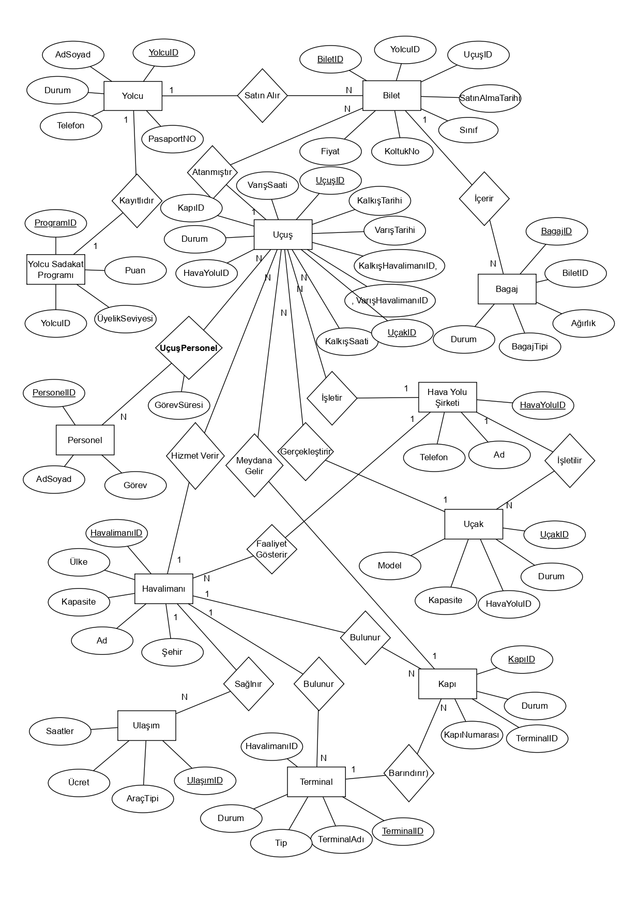

# Airport-Management-System
PostgreSQL tabanlı kapsamlı Havalimanı Yönetim Sistemi. Otomatik sadakat puanı artırma ve kapı durumu güncelleme Trigger'ları, detaylı raporlama View'leri ve normalize edilmiş ilişkisel veritabanı mimarisini içerir.

## 📊 Veritabanı Tasarımı (ER Diyagramı)
Projenin veritabanı mimarisi ve tablolar arası ilişkiler aşağıdaki gibidir.

[📄 Detaylı PDF Diyagramını İndir](Airport_Management_System_ER.pdf)

## ⚙️ Kurulum ve Kullanım (Installation)
Projeyi kendi bilgisayarınızda çalıştırmak için PostgreSQL veritabanında aşağıdaki SQL dosyalarını **sırasıyla** çalıştırınız:

1.  **`01_Tablolar_ve_Veriler.sql`**: Tablo iskeletini oluşturur ve örnek verileri yükler.
2.  **`02_Trigger_ve_Fonksiyonlar.sql`**: Otomasyon sistemlerini (Puan artırma, Kapı güncelleme vb.) devreye alır.
3.  **`03_Views.sql`**: Raporlama ekranlarını oluşturur.
