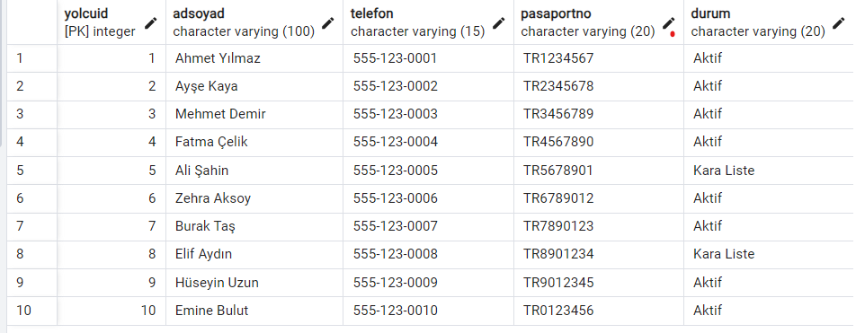

# Airport-Management-System

## 🎯 Projenin Amacı ve Çözüm Yaklaşımı
Modern havalimanlarında birbirinden bağımsız çalışan sistemler veri kopukluğuna ve operasyonel gecikmelere neden olmaktadır. Bu proje, **PostgreSQL** altyapısını kullanarak şu gerçek hayat problemlerine çözüm üretmesi amaçlanmıştır:

### 1. 🌍 Merkezi Veri Entegrasyonu
Tüm operasyonel birimlerin (Yer hizmetleri, Güvenlik, Yönetim) verilerini tek bir merkezde toplayarak veri güvenilirliğini sağlamış ve bilgi kopukluğunu önlemek hedeflenmiştir.

### 2. 🛡️ Güvenlik ve Risk Analizi
Yolcu profilleme sistemi sayesinde, yolcuların geçmiş seyahat verileri ve güvenlik durumları (Örn: Kara Liste kontrolü) anlık olarak sorgulanabilir hale getirilmiştir.

### 3. ⏱️ Operasyonel Verimlilik ve Esneklik
Sefer ekleme, iptal veya rötar durumları anlık yönetilebilir. Hangi uçuşu hangi ekibin gerçekleştirdiği takip edilerek kaynak planlaması optimize edilmiştir.

### 4. 🧳 Bagaj ve Lojistik Takibi
Yolcu bilet ID'si ile entegre bagaj takip sistemi sayesinde, kayıp bagaj vakaları ve yanlış yönlendirmeler minimize edilmeye çalışılmıştır.

---
## 🏗️ Sistem Mimarisi ve Kullanıcı Modülleri
Sistem, farklı kullanıcı gruplarının ihtiyaçlarına göre özelleştirilmiş modüller içerir:

* **👮 Operasyon & Güvenlik:** Uçuş koordinasyonu, kapı atamaları, gümrük ve kimlik doğrulama süreçleri.
* **✈️ Yolcu Hizmetleri:** Biletleme, check-in, bagaj durumu sorgulama ve uçuş süresi takibi.
* **📊 Yönetim (Admin):** Yolcu yoğunluk analizleri, performans raporları ve stratejik karar destek verileri.

---

## 📊 Veritabanı Tasarımı (ER Diyagramı)
Projenin veritabanı mimarisi ve tablolar arası ilişkiler aşağıdaki gibidir.

[📄 Detaylı PDF Diyagramını İndir](Airport_Management_System_ER.pdf)

# ✈️ Airport Database Management System

PostgreSQL tabanlı kapsamlı Havalimanı Yönetim Sistemi. Otomatik sadakat puanı artırma ve kapı durumu güncelleme Trigger'ları, detaylı raporlama View'leri ve normalize edilmiş ilişkisel veritabanı mimarisini içerir.

---

## ⚙️ Kurulum (Installation)
Projeyi çalıştırmak için SQL dosyalarını aşağıdaki sırayla çalıştırınız:
1.  **`01_Tablolar_ve_Veriler.sql`**: Tabloları oluşturur ve 4 temel veri setini (Havalimanı, Ulaşım, Yolcu, Havayolu) yükler.
2.  **`02_Trigger_ve_Fonksiyonlar.sql`**: Otomasyonları devreye alır.
3.  **`03_Views.sql`**: Raporları hazırlar.

---

## 🚀 Veritabanı Yaşam Döngüsü ve Kanıtlar
Projenin veritabanı inşası, gerçek hayat senaryosuna uygun olarak 4 aşamada veri oluşturma işlemi random gerçekleştirilmiştir. Her aşamanın PostgreSQL üzerindeki **gerçek işlem çıktıları** aşağıda sunulmuştur.

### 📍 Aşama 1: Havalimanı Verileri Ekleme İşlemi
Sistemin ilk adımı, uçuşların gerçekleşeceği lokasyonların sisteme tanıtılmasıdır. İstanbul, Londra, Dubai gibi merkezler `Havalimanı` tablosuna benzersiz ID'ler ile kaydedilmiştir.

 

### 🚌 Aşama 2: Ulaşım Verileri Ekleme
Her havalimanının şehir merkeziyle bağlantısını sağlayan Taksi, Otobüs ve Metro seçenekleri, ilgili havalimanının ID'si ile ilişkilendirilerek `Ulaşım` tablosuna işlenmiştir. Bu sayede hangi havalimanında hangi ulaşım aracının olduğu sorgulanabilir.

 

### 👥 Aşama 3: Yolcu Verileri Ekleme
Sistemi kullanacak yolcuların kimlik, iletişim ve pasaport bilgileri `Yolcu` tablosuna girilmiştir.
* **Önemli Detay:** Sistem, yolcuların hukuki durumunu (Aktif / Kara Liste) takip etmektedir. Çıktıda görüleceği üzere "Kara Liste"deki yolcular veritabanında özel olarak işaretlenmiştir.

 

### ✈️ Aşama 4: Havayolu Şirketi Verileri Ekleme
Uçuşları gerçekleştirecek olan Türk Hava Yolları, Lufthansa, Emirates gibi şirketler `HavayoluSirketi` tablosuna iletişim bilgileriyle birlikte kaydedilmiştir.

---

 

---

## 🧠 Gelişmiş SQL Özellikleri
Proje, sadece veri depolamakla kalmayıp, iş mantığını (Business Logic) veritabanı seviyesinde yöneten **Fonksiyonlar** ve **Triggerlar** ile donatılmıştır.

### 📊 1. Fonksiyonlar
Veritabanı üzerinde karmaşık hesaplamalar ve listelemeler yapan PL/pgSQL 2 adet temel fonksiyon geliştirilmiştir.

#### A. Uçuş Bilet Geliri Hesaplama
Yöneticilerin uçuş bazlı karlılığı görebilmesi için geliştirilmiştir.
* **Fonksiyon:** `UçuşBiletGeliri(UçuşID)`
* **İşlev:** Parametre olarak verilen uçuş ID'sine ait satılan biletlerin (Business, Ekonomi vb.) toplam tutarını hesaplar ve döner.
* **Örnek Çıktı:** 5 numaralı uçuşun toplam geliri hesaplanmıştır.

#### B. Anlık Kapı (Gate) Durum Raporu
Operasyon birimlerinin havalimanındaki kapıların durumunu raporlar.
* **Fonksiyon:** `KapıDurumları(HavalimanıID)`
* **İşlev:** İlgili havalimanındaki tüm kapıları ve şu anki durumlarını (Açık/Kapalı/Kullanılabilir) tablo olarak listeler.

 

